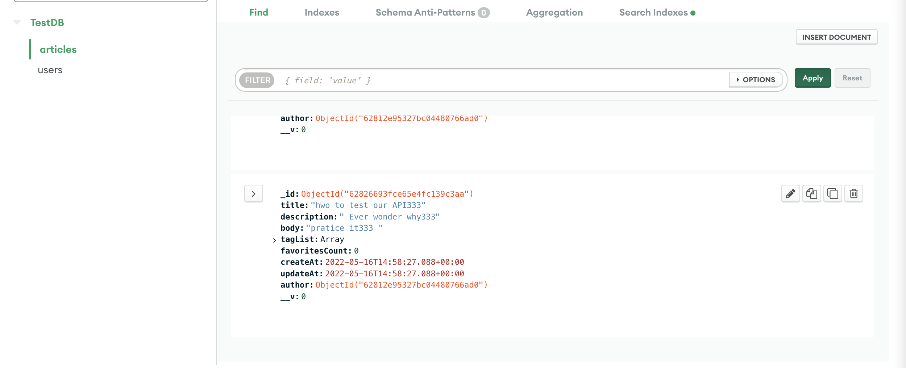
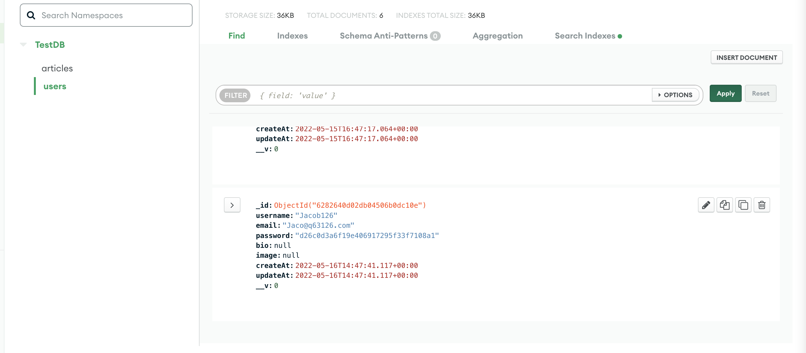
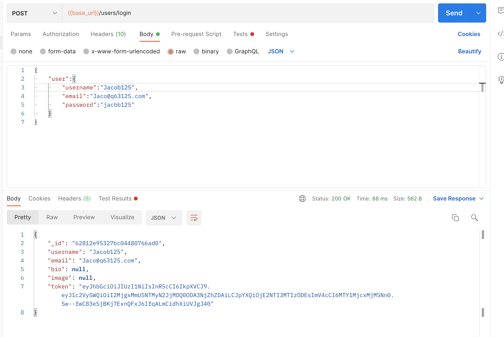
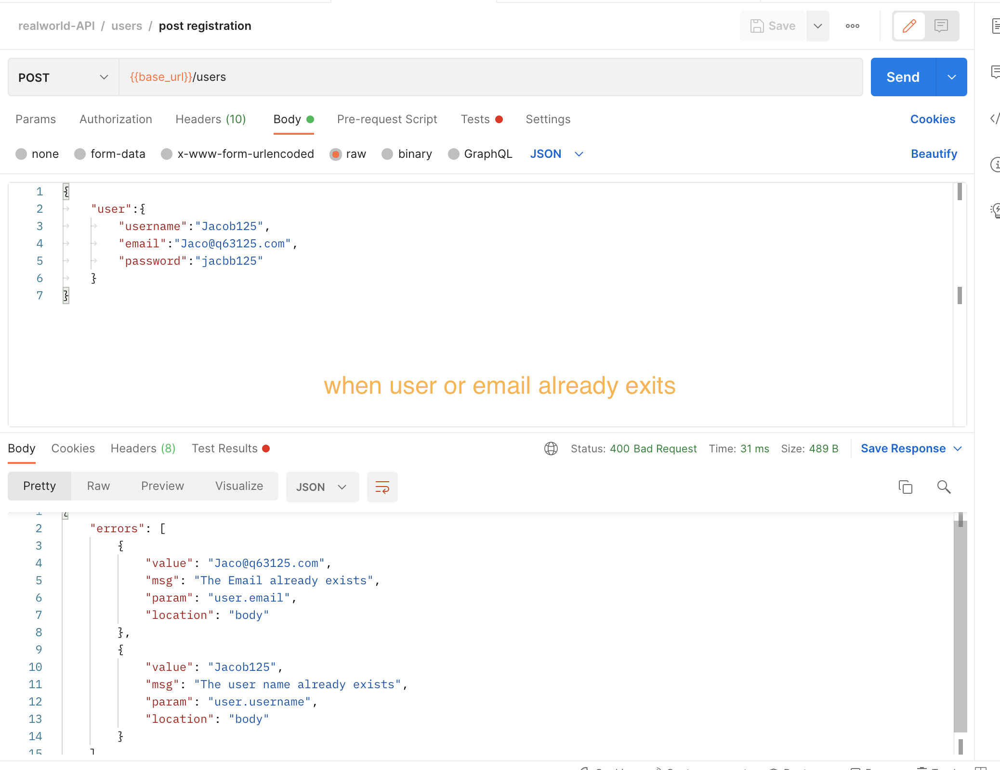
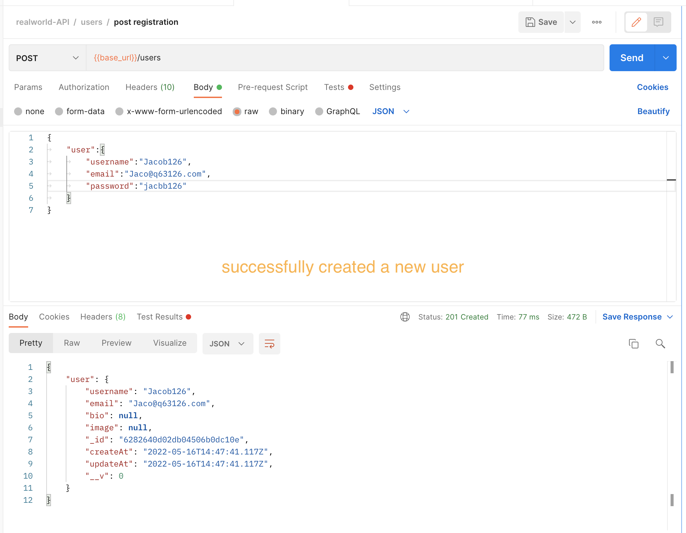
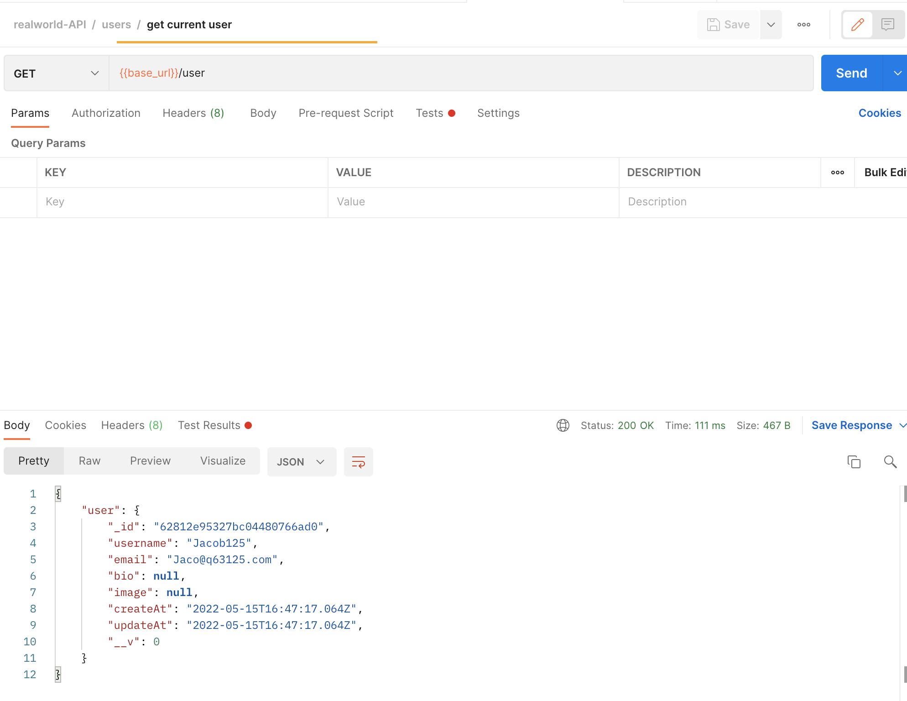
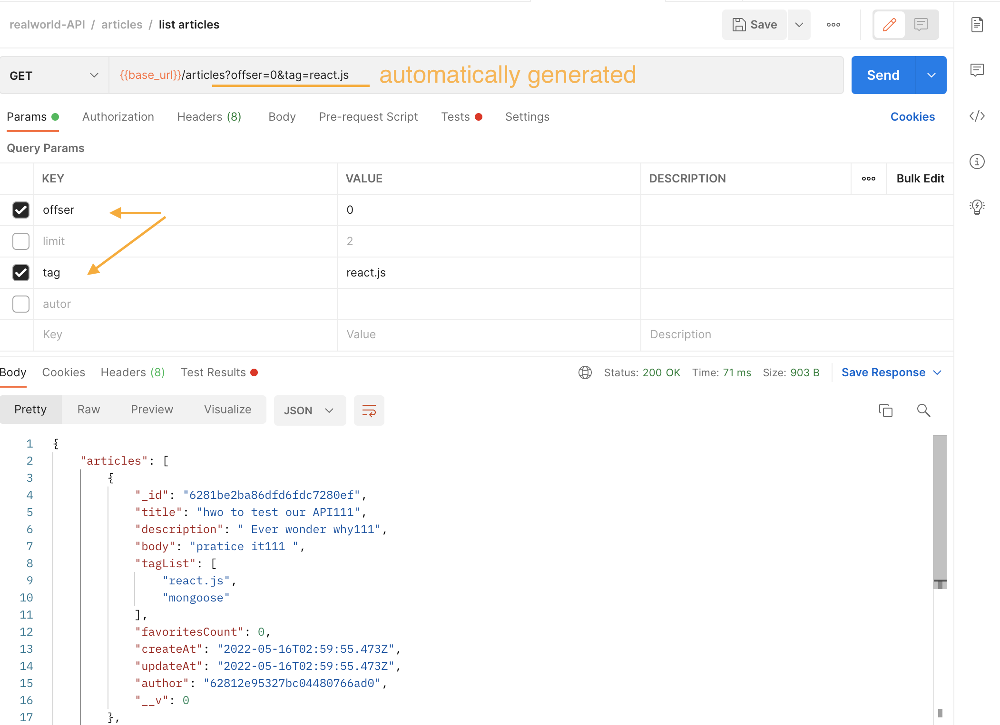
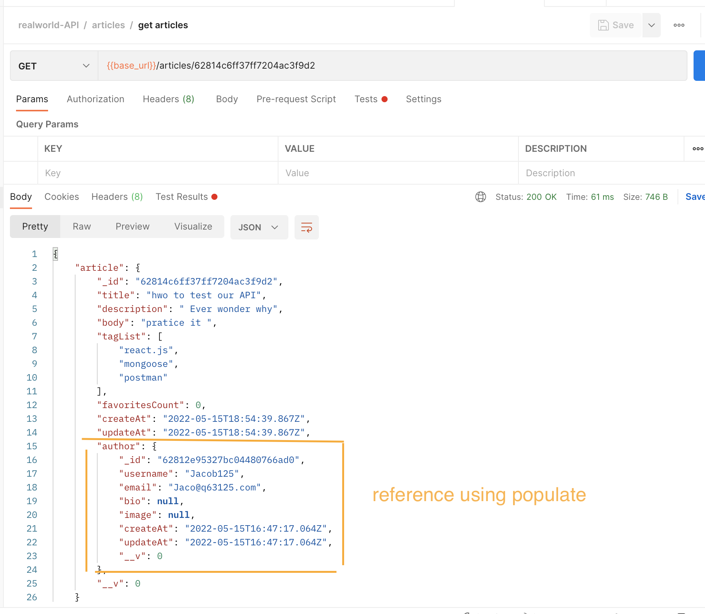
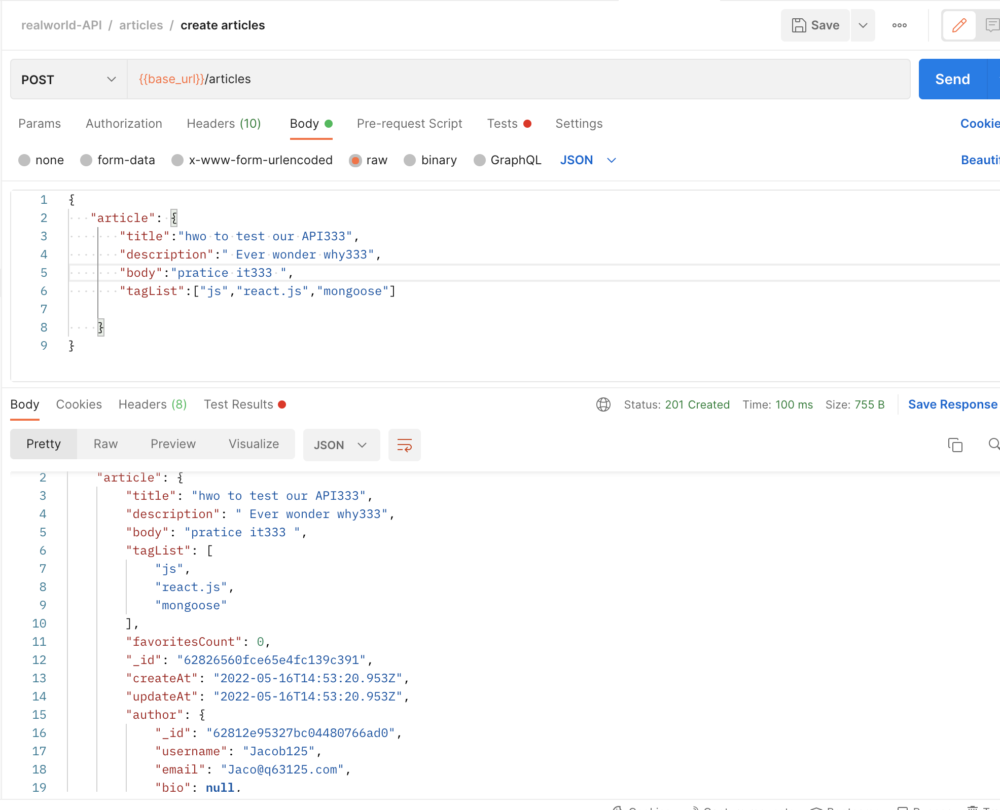
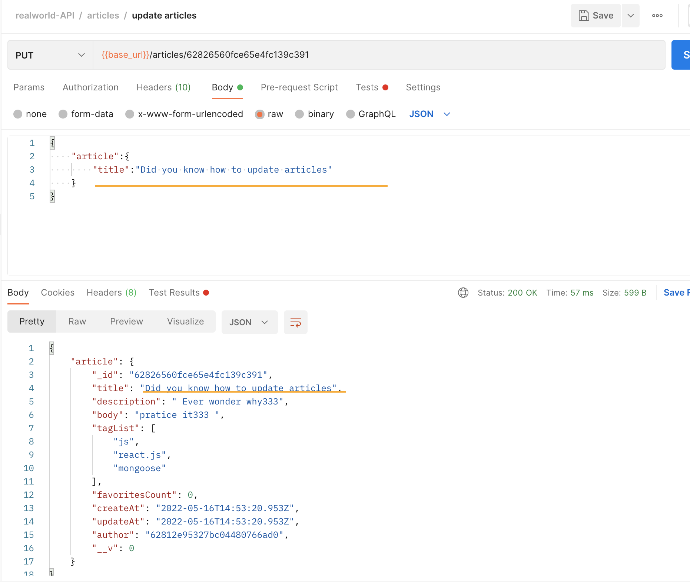

# RESTful-API-Implemetation

## Goal:Creating a RESTful API with express.js

[Reference to testing API real word](https://github.com/gothinkster/realworld/tree/main/api)

### achieved goals

1. adding routers to the API
2. handling errors & CORS
3. Generating & verifying JWT tokens
4. defining schemas and create models of mongoose
5. connecting to MongoDB on cloud environment
   ( Reference:Mongodb atlas )
6. testing APIs using a postman collection

# RESTful-API-Implemetation

# Goal:Creating a RESTful API with express.js

[Reference to testing API real word](https://github.com/gothinkster/realworld/tree/main/api)

### achieved goals

1. adding routers to the API
2. handling errors & CORS
3. Generating & verifying JWT tokens
4. defining schemas and create models of mongoose
5. connecting to MongoDB on cloud environment
   ( Reference:Mongodb atlas )
6. testing APIs using a postman collection

